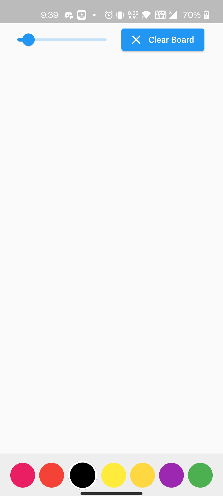
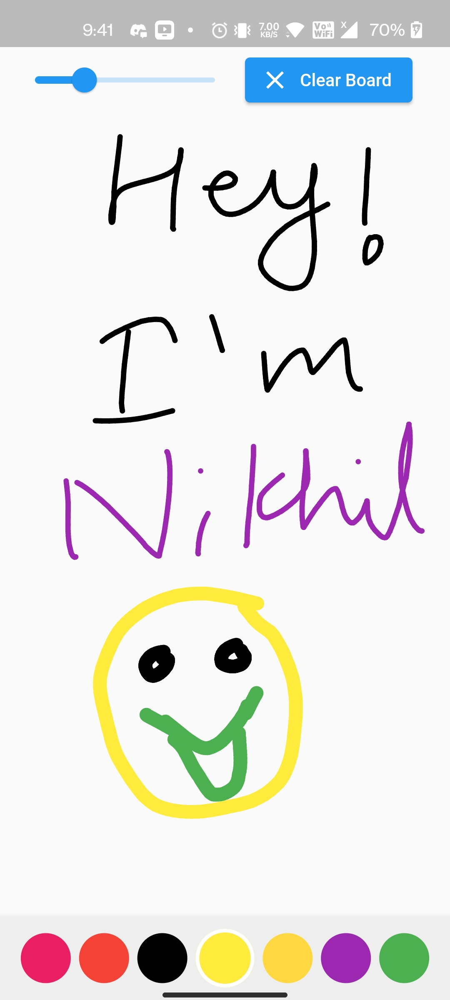
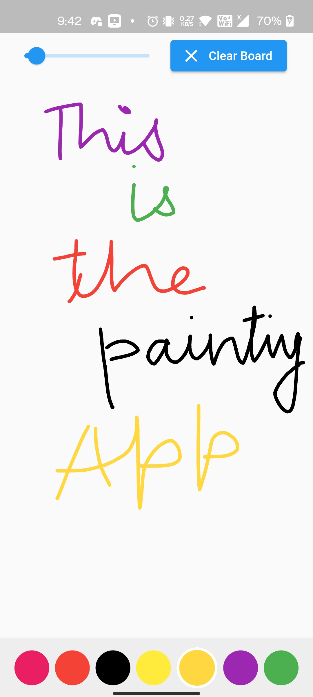

# PaintingApp

PaintingApp is an android app which allows the user to draw anything on the white board. The user can choose from the given colors & they can even select the thickness of the brush. After drawing, the user can clear the board.

**Tools Used** 

I have made this project using **Dart** and **Flutter**

**End Results:**  
*Images:*

